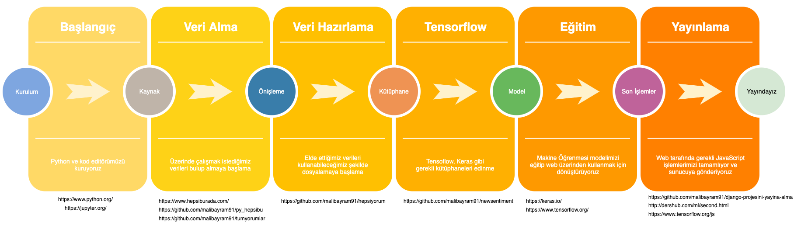

# Temel Tensoflow Eğitimi

## Modelin çalışır haline [buradan](http://dershub.com/ml/28ekim/web/index.html) ulaşabilirsiniz

## Yararlandığım Udemy Kursları

* [Python ile Makine Öğrenmesi - Dr. Şadi Evren Şeker](https://www.udemy.com/course/makine-ogrenmesi/)
* [Doğal Dil İşleme A-Z™: (NLP) - H. İbrahim CEBECİ](https://www.udemy.com/course/dogal-dil-isleme/)
* [Veri Bilimi ve Veri Bilimcilik için Giriş Eğitimi - M.Vahit Keskin, Veri Bilimi Okulu](https://www.udemy.com/course/veri-bilimine-giris/)
* [Veri Analizi ve Makine Öğrenimi için Python A-Z™ - H. İbrahim CEBECİ](https://www.udemy.com/course/veri-analizi-icin-python/)

## Aşağıdaki diagrama da [buradan](https://www.draw.io/?lightbox=1&highlight=0000ff&edit=_blank&layers=1&nav=1&title=makineOgrenimi#R7V1bc5s6EP41PMYDCDA8%2BtpOM512Jj2n06czspFtxVxcIeo4v%2F5IIGyDCMapDSRxHlpYJBHtt7vst0hEASP%2F6ROBm9XX0EWeoqvukwLGiq4DTbd6Jjvgsl0qs3U7FSwJdlORdhA84GckhKqQxthFUa4hDUOP4k1eOA%2BDAM1pTgYJCbf5ZovQy991A5dIEjzMoZdJswlw%2BU%2Fs0pWQa5ZzuPAZ4eWKZjO00gszOF8vSRgH4o6KDhbJT3rZh9lYYqrRCrrh9kgEJgoYkTCk6ZH%2FNEIe12%2BmuLTf9IWr%2B%2FkQFNA6HRbuwzT6%2FeXnr%2B144z3h72bsfrsTk%2FwDvRhl00h%2BWbrLVLRdYYoeNnDOz7fMEBQwXFHfY2caO0w0gFxxtp%2Bkyk8oCdd7rdpMsggDKoxA5y2gh5cBO5mzOSDCG2DPG4VeSJJ7g%2BnUVtXDULkr%2FIddkdUgNPMHEYqejkRCLZ9Q6CNKdqxJdtUAAlNhxYYqrGJ7sAjdFjiujozBAEIIhR0u94MfkGAHAowzgMkc5AiZX3CnjAxlqAUe9KGEE5sszUOTV1oQBqigYSGSUOCqw8xJBuKCj12X32ZYZgsHA1CLBnAMd1%2Bcl2GYtBMzKbHrCwCq1wTUuhqemoTnTzTj4Q4SuBC4upCHRETQ2sPs6Av8Ax%2FmBG%2BoolseB3dG2NGSH2FlZCrO1EO%2Bhwj28TNOxvIhQz8ZbMe0zHUmd43iIJ7Hu%2BReyggoQ4vhRzDrED%2B%2FMavSjAqruoYh9esaknM1Q9JPh2wPJwjk46%2F%2BUtw%2B6baVUVqgfeUAbRb82S6BwSiBQbsaDNYNBh04rcMAbjDo%2FbJ0pVkYjNMwHD9CjvXrwmi113z9hwYbY8NH9p%2BWnJz0Ujag9%2FgdcYTcAT%2Fnw3MlqT2LH3IFGvw2QUjnXFGayfFDLFXnN2PNDNkWcmajlRjEyQdiygz0%2BfxC%2BJt6Hn%2BzDyT8NbXR7MasyFbd7EjOLtjQjOm9lAPU8888QFZJgnCKZbgmsl3j6m5rmU4eNkN2Wy3TZM5tM%2BHlcTvttu3Sv7FjWdcGplXyZ6kutGfOwtAtw3ABvKuR3rUKyWSsa3LUuzQkWqcwkZOMfxlhYpKBdyPiZ%2BHYJA%2BXYCxJUhj9dUbPDEymOXaJnw%2F6UFDolGL7cM0HjShyMZc7U063ZVrNtIK91CxmsRdv%2BG%2FPzCPh2TMo6PrbK9xcm2IXTaRRhi2ZyAdkdaD4%2FGuSW0sA9G8ANErnJABsCYB7uAt4DOxk7j6cDo2BUwnRFYOX3mpKL2FX423OjYVfiIUbaoskXEJeqxE322VyI1WVU5sLu6PpdIo2aHIsFbzhM3xOU0zyBjPCRhmEBGmrDEKTI%2BzES5gDojTHDtQDHSgShXXseTCAM3aZKf%2B4T0oS0BonYxb7uWG0g9xebpTiPJtpl1Jk6z8%2BUkprFXl%2Fq5xCr1HmfO8ItEsqMoUXSy9WcFjHgCRMusEwgNMfDwZtMQwTdIph6DXet94oxoUohmV3iWLoNd7xtksxhg1QDLvfKYqhyy9ef6AgCsnCY6p9W2lho7xCwrFVXqHLdecExhRFNp56jwi7o64u8ayEUhzWDK6TFX0jmv63WcEAiZcSyMVByUO22zZxbapQNIOWqcIHrH7bRYLfLlWQSzYfDoGWqYJcYrmXY5oESje4wmTqABO0xRVsrVNcAdQofNy4woW4Al8n1R2uALq%2BsGziOA3sK9KKy9ZbXsYkV2Emov5Msf%2FGMsNmNxRJSLZKF4BchfkK1zwtSZcwsQd6AiubsY8invz7fO%2Bm2CZUJA9obwN8zdI22ZWUPmrFwqiA84rkpYVYC5Uuk8JByTsKsaEo7Z%2FW9sRzm6T%2F3bYZ1TCvdmkIqFHpeW9JsKYVCwKt8hAg13U%2BHgTtEhEg12TEDvhOUg%2FLHtrmqC3qoalOt7hHjUrKjXtcakOSbnSKfMg1nIcwSJIaQxmqxxunO%2BrLw6kFnNZeOWqg37mNSjJzGe7XvwTLbLk%2Bz0rfWGrZ7HaMrn0VQeYx33d0lTgr%2F3KBug5d9i9yccohLMEhfEFPBMsoWWFF4hvPOIl%2F%2Bx8z%2BIBEo3NfMviATKNz%2B%2BdlqnHPQpgXy0W5biQo%2FcnAmlTXT68YxvbLyQ75Sa%2F1DOVGOJokHC3yDdd%2B0ra%2Ff1k%2FxoG5HtOVejdclW6kT7MSvlZ7RdAikVq%2F4zDNPyj%2FwN2A31Sfbrfb3ibJe3ohWSayrGGW0Zzu4KXNpzDrUiP3ISjCz3CWNOBIb0Ic0EQ15lAxx%2Fy3j2kYicBwZJweWtAS06QhD0IRi0k4WP7gJ%2BM7Y%2F%2BrSPiWWEFFgSEPuZ3F52PIy2K2fi3IZUpyBuSPMcMPkZp4S63fO9hZlwxsqwRs7TJg%2FxMh8m32yD8uqasenCEvC9ZFj1uhTYRnMYEu7M1DP7nAb8ayo%2FW5fSotCxwpR1hiJbIX0HhxD2qpezklGn%2FFi0p2eqT0MzyujC3U9rglpqt4JkDwmW3P4I5A32F6mbqPMFiGdxsSPjInCfDdDu5wAO9g8nmHat%2F8i3HfuxcXv1NlAzlLA2aTblwF1mb3n%2FDWarc%2BZ4xKczZbcfMsU64Irfs06fKO%2Fvcw0djnpR3fg%2BT1OEmDVAJldSAe2yUw9TsMU%2BIGiY5fj1JxjEqQ%2Bs2DVNxjVfbQ7LQvBWgbsblin0%2F41TDJo1QCZTcPVHGFaylQZYXP6wO117CLSHSkYqaWaYTmYeD2El2UoHNW10pInOYhkZMDswSTshy%2FSefhKTzd76fZ869TWf8LXaorCGoLIBRXXJQSrbYfM2u%2B9aWHw5OqlxpWK1zrgsLLeFYnrf4xeoXdZ52qgdC7EH76JUBc75HARIe%2F%2FJA0P%2FoTG2DyPw%3D%3D) ulaşabilirsiniz

##

##
